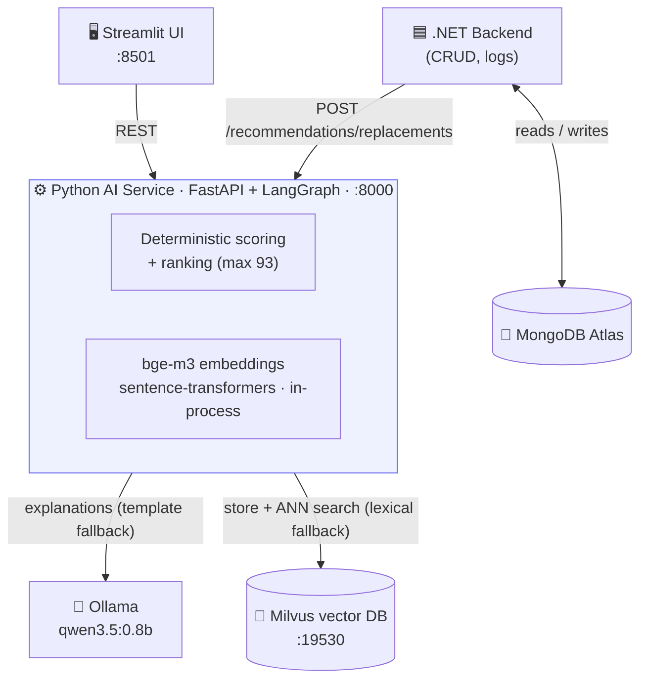
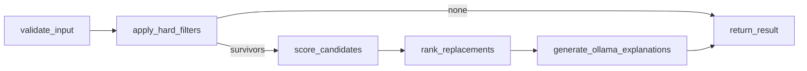

# smart-substitution-engine

An AI-powered substitution engine that suggests the best alternative in real time
when an item is out of stock or unavailable. The system automatically proposes
optimal products balancing **price and quality**, ensures **category/allergen
compatibility**, and prioritizes **suppliers the customer already has contracts
with**.

This is a monorepo with three parts:

| Folder | Owner | Stack |
|---|---|---|
| [`ai-service/`](ai-service/) | Python AI Engineer | FastAPI · LangGraph · sentence-transformers · Milvus · Ollama |
| [`ui/`](ui/) | Python AI Engineer | Streamlit demo UI (→ AI service) |
| [`backend/`](backend/) | .NET Engineer | ASP.NET Core · MongoDB Atlas |

The .NET backend calls the Python AI service at `http://localhost:8000` — see
[`INTEGRATION.md`](INTEGRATION.md) for the contract and [`HACKATHON.md`](HACKATHON.md)
for the full plan. This README documents the **Python AI service** (`ai-service/`).

---

## Architecture



> The LLM never picks replacements — Python ranks deterministically and Ollama
> only explains. Every external dependency (Ollama, Milvus, embeddings) has a
> fallback, so the service degrades gracefully instead of failing.

---

## How it works



1. **Hard filters** remove ineligible candidates (inactive, out of stock, same
   product, incompatible category, price over threshold).
2. **Deterministic scoring** ranks the survivors (max 93 points):

   | Dimension | Max | Logic |
   |---|---:|---|
   | Category similarity | 30 | Exact category = full; otherwise **semantic embedding** similarity |
   | Contract match | 25 | Preferred supplier = full; under contract = partial |
   | Price similarity | 20 | Cheaper/equal = full; decays to 0 at the price ceiling |
   | Stock availability | 10 | Scales from "just enough" to "ample buffer" |
   | Unit / pack similarity | 8 | Same unit + pack size = full |

3. **The LLM never chooses replacements.** Python ranks them deterministically;
   Ollama only writes a short, grounded explanation **after** ranking. If Ollama
   is unavailable, a deterministic template explanation is used instead.

### What makes it *smart*
- **Semantic similarity** via the BAAI `bge-m3` embedding model (run locally with
  `sentence-transformers`, GPU-accelerated) lets the engine recognise that
  "Chicken Thigh Fillet" is a closer substitute for "Chicken Breast" than "Frozen
  Carrots" — even across category boundaries — with a deterministic lexical
  fallback when embeddings are off.
- **Milvus vector store**: product embeddings are persisted in a Milvus vector DB
  (`pymilvus`) — used as an embedding cache in the scoring flow and exposed via
  `POST /index/products` + `POST /search/similar` for catalog-wide ANN retrieval.
  Falls back to in-process embeddings if Milvus is unavailable.
- **Grounded explanations**: the LLM is fed only verified facts (never asked to
  invent prices/brands), so explanations are trustworthy.
- **Graceful degradation**: works with Ollama on/off, embeddings on/off, Milvus
  on/off — every layer has a fallback, so it never crashes.

---

## Quickstart

### Option A — Docker (self-contained: UI + AI service + Milvus + Ollama)

```bash
docker compose up --build
```

Brings up the whole stack, auto-pulls `qwen3.5:0.8b`, and serves:
- **Demo UI** → <http://localhost:8501>
- AI service / Swagger → <http://localhost:8000/docs>
- Milvus UI (Attu) → <http://localhost:8002>

See [`DOCKER.md`](DOCKER.md) for details. First run downloads the models
(~minutes); after that it's instant.

### Option B — Local Python

```powershell
cd ai-service

# 1. Install dependencies (into your current Python environment)
python -m pip install -r requirements.txt

# 2. Make sure Ollama is running with the chat model pulled
#    (embeddings run locally via sentence-transformers — BAAI/bge-m3 downloads
#     automatically from HuggingFace on first use)
ollama serve
ollama pull qwen3.5:0.8b

# 3. Run the service
python -m uvicorn app.main:app --reload --port 8000
#    or: ./run.ps1
```

- Swagger UI: <http://localhost:8000/docs>
- Health check: <http://localhost:8000/health>

Try it:

```powershell
curl -X POST http://localhost:8000/recommendations/replacements `
  -H "Content-Type: application/json" -d "@examples/sample_request.json"
```

---

## Demo UI (Streamlit)

A point-and-click UI for demos lives in [`ui/`](ui/). It talks directly to the
AI service (no MongoDB needed) and has two tabs:

- **🔁 Replacements** — pick a scenario, edit the out-of-stock product + candidate
  table, and see ranked replacements with confidence badges, per-dimension score
  bars, Ollama explanations, and the rejected-candidate reasons.
- **🔍 Vector Search** — index a sample catalog into Milvus and run similarity
  search over it.

```powershell
# With Docker: included in `docker compose up`  ->  http://localhost:8501

# Or locally (AI service must be running on :8000):
cd ui
python -m pip install -r requirements.txt
streamlit run app.py            # opens http://localhost:8501
```

Point it at a different AI service with `AI_SERVICE_URL` (env var) or the field
in the sidebar.

---

## Configuration

All settings are environment variables prefixed `SSE_` (or a local `.env`).
Copy [`.env.example`](.env.example) and adjust. Highlights:

| Variable | Default | Purpose |
|---|---|---|
| `SSE_CHAT_MODEL` | `qwen3.5:0.8b` | Ollama model for explanations |
| `SSE_EMBEDDING_BACKEND` | `sentence_transformers` | Embedding backend (`sentence_transformers` or `ollama`) |
| `SSE_EMBEDDING_MODEL` | `BAAI/bge-m3` | BAAI BGE model for semantic similarity |
| `SSE_EMBEDDING_DEVICE` | _(auto)_ | `cpu` / `cuda`; blank = auto-detect GPU |
| `SSE_ENABLE_EMBEDDINGS` | `true` | Toggle semantic similarity (off → lexical) |
| `SSE_ENABLE_LLM_EXPLANATIONS` | `true` | Toggle LLM (off → template explanations) |
| `SSE_ENABLE_MILVUS` | `true` | Toggle the Milvus vector store (off → in-process only) |
| `SSE_MILVUS_URI` | `http://localhost:19530` | Milvus endpoint (`http://milvus:19530` in Docker) |
| `SSE_W_CATEGORY` … `SSE_W_UNIT_PACK` | 30/25/20/10/8 | Scoring weights (tune Day 3) |
| `SSE_MAX_PRICE_INCREASE_PCT` | `0.25` | Reject candidates pricier than +25% |
| `SSE_ALLOW_CROSS_CATEGORY` | `true` | Allow semantically-compatible categories |
| `SSE_ENFORCE_DIETARY_TAGS` | `true` | Allergen/dietary hard filter |

---

## Vector search (Milvus)

Product embeddings are stored in **Milvus** and exposed for catalog-wide
similarity search:

```powershell
# 1. Start Milvus (or the whole stack with `docker compose up`)
docker compose -f ai-service/milvus-standalone-docker-compose.yml up -d

# 2. Seed a sample catalog (from ai-service/)
cd ai-service && python examples/seed_milvus.py

# 3. Search the catalog by vector similarity
curl -X POST http://localhost:8000/search/similar `
  -H "Content-Type: application/json" `
  -d '{"name": "Chicken Breast 2kg", "top_k": 5}'
```

`POST /index/products` bulk-loads products; `POST /search/similar` returns the
nearest neighbours (ANN, cosine). Browse the data in **Attu** at
<http://localhost:8002>. Both endpoints return `503` when Milvus is disabled.

---

## Testing

```powershell
cd ai-service
python -m pytest                 # offline unit + API + contract tests (no Ollama needed)
python -m pytest -m integration  # live tests against a running Ollama
```

The offline suite mocks Ollama + Milvus, so it is fast and deterministic.
Integration tests auto-skip when Ollama / Milvus are not reachable.

---

## Project layout

```
ai-service/                 ← this service (run commands from here)
  app/
    main.py            FastAPI app, lifespan, /health + /recommendations endpoints
    config.py          Settings (env-driven weights & thresholds)
    schemas.py         Pydantic request/response models (the .NET contract)
    engine.py          Wires providers → services → graph
    providers.py       Ollama chat + sentence-transformers embeddings (+ health probe)
    vectorstore.py     Milvus vector store (upsert / fetch / ANN search)
    services/
      filters.py       Hard filters (incl. dietary/allergen safety)
      scoring.py       Deterministic scoring + ranking + confidence (pure, no I/O)
      similarity.py    Semantic similarity (Milvus-cached embeddings) + lexical
      explanation.py   Grounded LLM explanations + template fallback
      retrieval.py     Catalog indexing + vector search (the /index, /search endpoints)
    graph/
      state.py         LangGraph shared state
      nodes.py         Node implementations
      workflow.py      Graph wiring (the 6 nodes above)
  tests/               Unit, API, contract, and live-integration tests (Ollama + Milvus)
  examples/            Sample request, flow tracer, Milvus seed + catalog
  Dockerfile          CPU image (build context = ai-service/)
  milvus-standalone-docker-compose.yml   Run Milvus on its own
  requirements.txt
ui/                         ← Streamlit demo UI (app.py, Dockerfile)
backend/                    ← .NET service (owned by the .NET engineer)
docker-compose.yml          ← root: ui + ai-service + Milvus + Ollama
```
